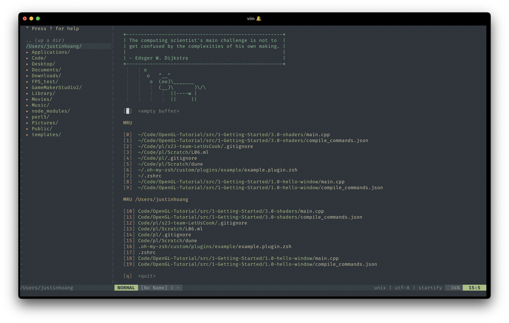
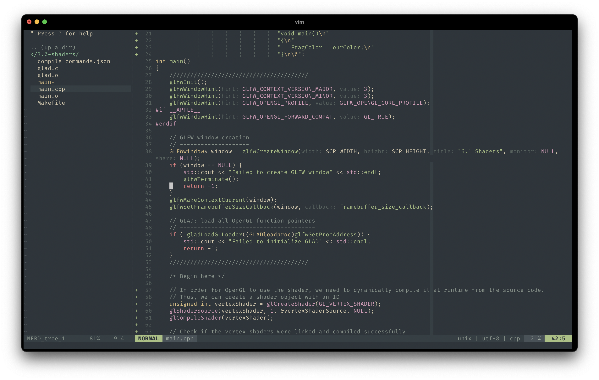
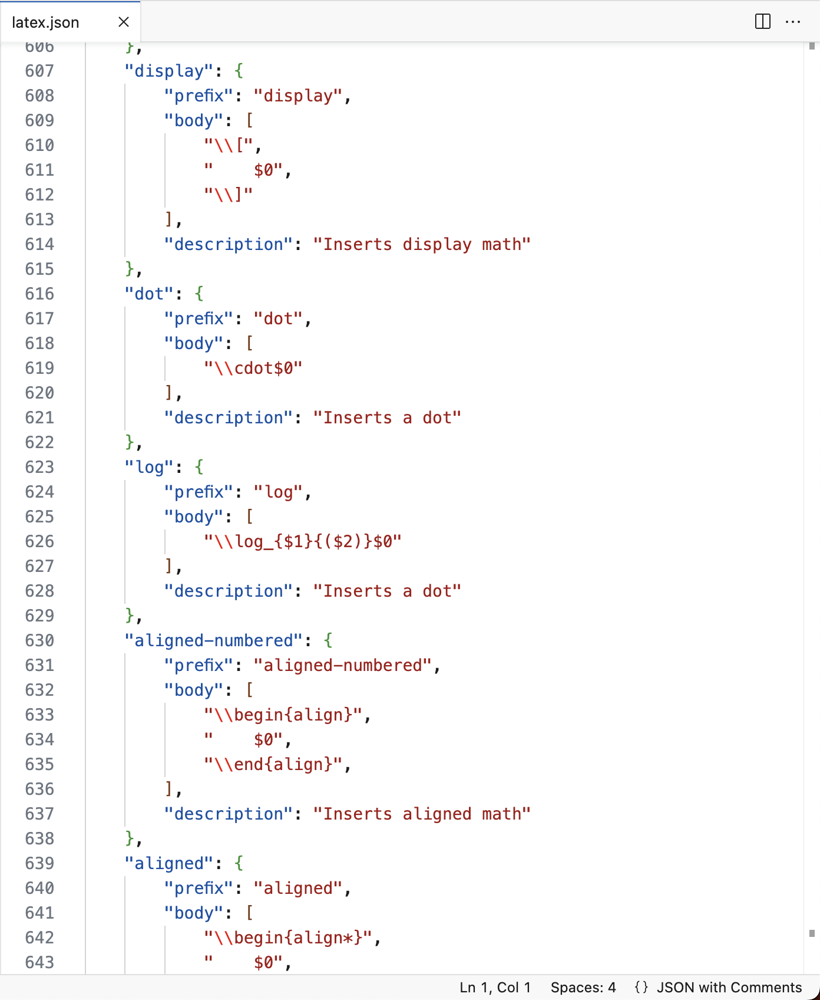
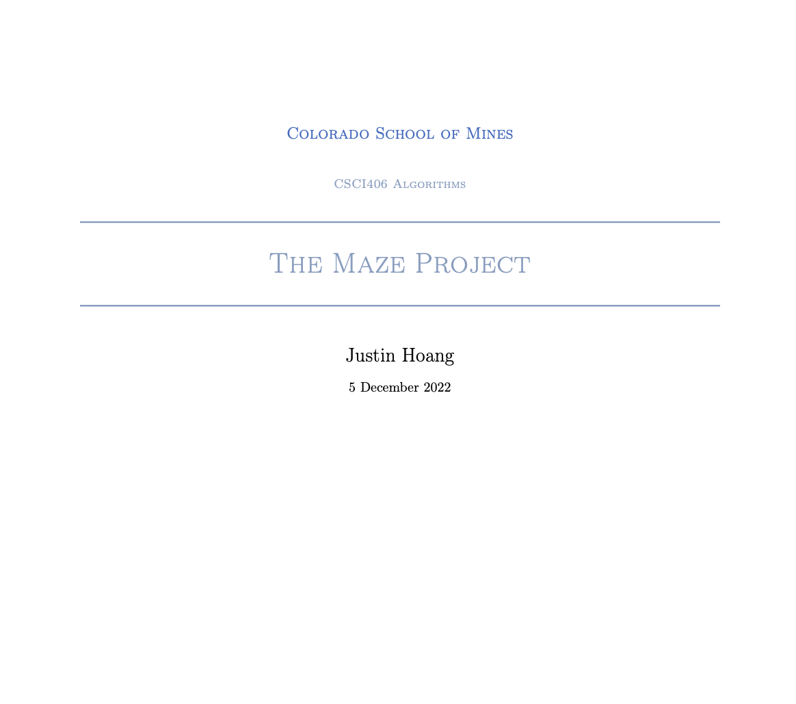
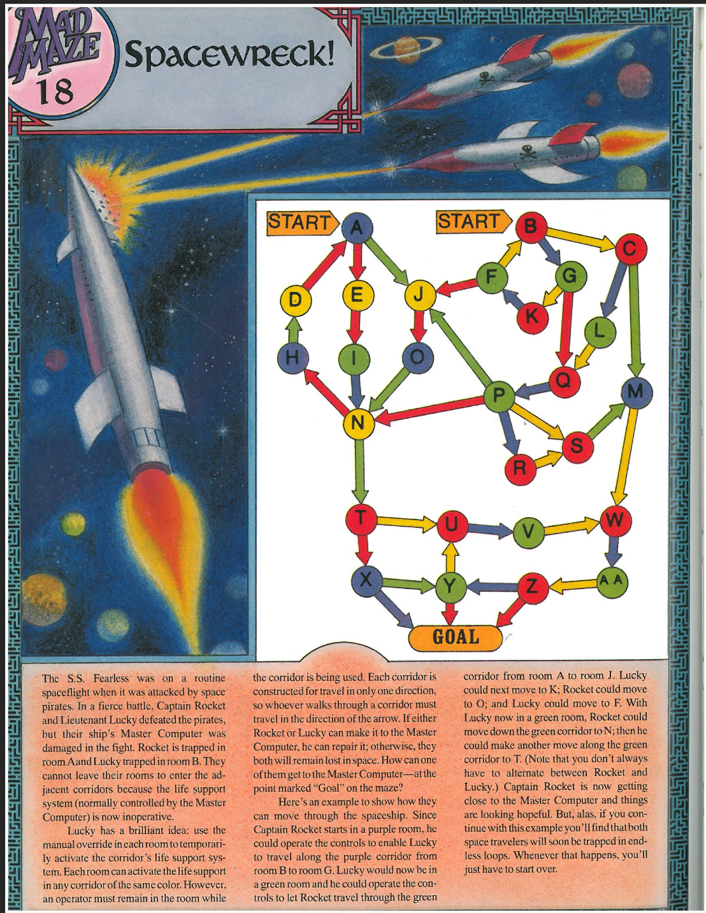
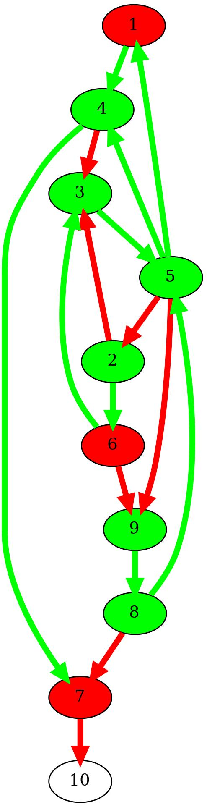
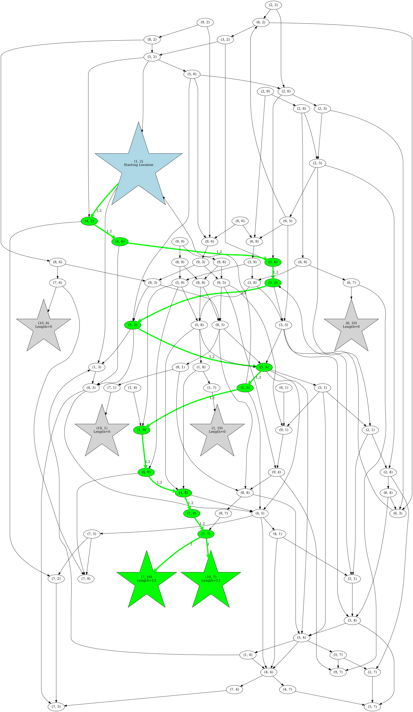

# Hi There

My name is Justin Hoang, and this is a collection of featured work from over the
years of being at Mines as a Computer Science major.

## CS-Tips

Beginning in the Summer of 2022, I started a personal
[repository](https://github.com/suasuasuasuasua/cs-tips) to help friends get
started in Computer Science. Right now, it covers preliminary content like
setting up a programming environment and other topics that I feel are brushed
over in early CS careers.

I've gotten a little busy over the past year with school and job applications,
but this is a project that I hope I can continue even if it doesn't reach a wide
audience. Nevertheless, I hope I can help that the audience it does reach.

## `vim` and `neovim`

I first picked up `vim` in the Summer of 2021. I was mystified when I first say
a classmate using it to ssh into a headless raspberry pi. "Is that in a
terminal?", "How do you even move around?", "You're telling me you can't click
around with the mouse?", "Why would you ever do this?". These were all questions
in my head as I was watching him flawlessly maneuver through and edit the files.
I made it a personal goal to learn and master `vim` over the Summer.

Cut forward to today. No, I am still not a master, but I do feel much, much
faster and elegant when editing code, whether it's on pure `vim` or with an
extension an Visual Studio Code. Here's a guilty pleasure of mine: I can become
very obsessed with tweaking my `.vimrc`. [Check it out
here.](https://gist.github.com/suasuasuasuasua/6d765effcd4e69fa318a9f38d92e3c77).

Here's what it looks like right now.

|                                    |                                      |
| ---------------------------------- | ------------------------------------ |
|  |  |

As of now, I've been tinkering with `neovim` because I've heard that it's much,
much better than vanilla `vim`, but who knows. I didn't want to spend too much
time and become obsessed again, so I've been using
[AstroNvim](https://astronvim.github.io/), which has been wonderful even though
its sacrilegious to not write all of your own configs.

## `LaTeX` homework and reports

Starting my sophomore year, I began writing my homework, notes, and reports in
`LaTeX` instead of Microsoft Word or handwriting it. I developed on Windows
(WSL), Debian, and MacOS. No matter the operating system, I installed the
complete `texlive` packages from `apt` or `brew` and used [Visual Studio
Code](https://code.visualstudio.com/) with the [LaTeX Workshop
Extension](https://marketplace.visualstudio.com/items?itemName=James-Yu.latex-workshop).
I took advantage of [the vim
emulation](https://marketplace.visualstudio.com/items?itemName=vscodevim.vim)
and snippet support in Visual Studio Code to become very efficient in the
process.

|             Assignment             |   Description   |
| ---------------------------------- | --------------- |
|  | Some snippets that I wrote to increase my productivity and speed whilst writing LaTeX documents in Visual Studio Code. |
|  | A sample title page from the final report in algorithms. The color palette and structure was inspired by Mines but designed by myself. |
|  | A sample homework problem from the dynamic programming module. The document is beautifully formatted with solution boxes and typesetted with inline math, code blocks, and tables. |

## Graphs with `boost` in `C++`

For the final project in algorithms, we were tasked to solve a seemingly simple
game. Given two agents in a maze, help them find their way out! The caveat is
that only one agent can move at a time while the other must stay and activates
the link between the rooms. The challenge is that the color of the path and room
must match. If either of them get into a deadend, then it is game over.

However, instead of solving this particular graph and calling it a day, the goal
was to solve any arbitrary maze by defining the path of least cost, as well as
the steps to take. The necessary algorithmic approach is to represent the states
of the game; if person A is at location X and person B is at location Y, what
are the possible paths? It should be noted that there are some unreachable
locations which is determined by the starting position of the agents.

Using the `boost` library in `C++`, I visualized and highlighted the paths of
least cost (there may be multiple). Optimal paths are highlighted in green,
while inefficient or unreachable graphs are grayed out.

|         Original Graph          |           Translated Graph           |
| --------------------------------| ------------------------------------ |
|  |   |
